# Game On
---

## What It Is
Game On is a full stack web app used to visualize sports data. It allows users to visualize player and team stats like never before and perform analyses that have previously been difficult to render. Users can log in with a user name and password, save favorite players, and build visualization charts from player data.
Users also get an automatically-updated news feed for timely inspiration of players to compare stats on.
## Team members
* <a href="https://github.com/cshall13">Shane Hall</a>
* <a href="https://github.com/chadm9">Chad McKee</a>
* <a href="https://github.com/VinozzZ">Yingrong Zhao</a>
* <a href="https://github.com/henaege">Drew Tolliver</a>

## Languages and Technologies used
* Node.js
* Express
* MySQL
* JavaScript
* jQuery
* HTML
* CSS
* Highcharts.js


## Dependencies and Plugins
* express
* express-session
* body-parser
* mysql node
* mysportsfeeds.com API
* newsapi.org API
* jquery.mb.YTPlayer
* Bootstrap
* Google Fonts


## Team Strategy
It all began with Yingrong's idea to do data visualization. She and Drew planned to work together based on the work they did on a previous project. Initially, the idea was to do data visualization on things like budgets, diet, exercise, and the like. Drew then came up with the idea to do visualizations with sports stat data. The main focus for the MVP would be the NBA due to the relative simplicity of the stats and the timeliness of the NBA playoffs occuring at the same time as the project. They soon recruited Chad, and were then lucky to be able to sign free agent Shane to complete a four-person super group.
<br>
Mob programming was utilized to build the database and core functionality, as well as the front-end elements. The team got off to a quick start and were able to complete several of their requirements on day one.

## Site Walkthrough

### Landing Page
Users are treated to a full-page background video with a simple logo, log in button (for those who already have accounts), and a Get Started button (for those who don't). An About button gives new users a summary of the power they are about to unleash. The full page video lends an atmosphere of immersion and the simple interface lends it self to a quick, frustration-free user experience.
The Get Started button takes a new user to a registration form where they can enter a user name and password. Their data is sent to a MySQL database via the insertQuery method used by mysql node. User input is sanitized to avoid insertion attacks and Passwords are encrypted and stored in our database securely using bcrypt.
<p align='center'>
    </img>
</p>

### User Page
After logging in the user is brought to their User page. This is where the magic happens. A default chart is displayed in the center of the page using data from the database. The controls on the left allow the user to build their own chart based on players of their choosing.
Our backend uses express to query the database for the requested information and the data is rendered by highcharts.js into a beautiful visualization. The page is rendered using Pug (Jade).
Along the right side of the page a news feed allows a quick reference for timely data comparison ideas and is updated automatically.
<p align='center'>
    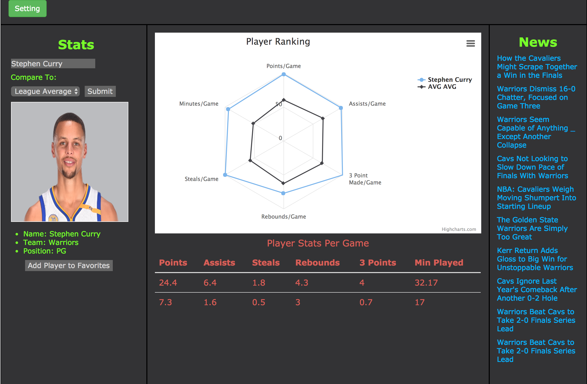</img>
</p>


### News
News stories are displayed on the right-hand page, allowing a quick reference for timely data comparison ideas.
<p align='center'>
    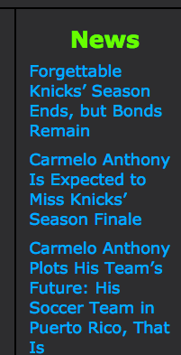</img>
</p>


## Challenges

### Challenge 1 - Getting the mysportsfeeds.com API working
mysportsfeeds.com does not use API keys to access the data. Instead, an account username and password are used, with both being encoded into base-64 ASCII format via btoa.
In addition, the JSON file was being sent over as a string, so we finally figured out we needed to use JSON.parse() to be able to acces the object elements. It took an hour or so to get the code organized correctly so we could pull the exact data we needed.
<br>
```JavaScript
}((error, statusCode, headers, body) => {
  console.log('ERROR:', error); 
  console.log('STATUS:', statusCode);
  console.log('HEADERS:', JSON.stringify(headers));

  APIdata = JSON.parse(body);
});
  ```
### Challenge 2 - Sending the API data to the database
Pickled man braid flexitarian neutra, try-hard fixie portland tacos synth direct trade four dollar toast tbh. Fanny pack selfies adaptogen DIY chicharrones messenger bag, succulents health goth cliche bushwick typewriter cray fashion axe. Meditation affogato trust fund ennui letterpress. Banh mi mumblecore kogi 8-bit pickled. Pop-up jean shorts cornhole edison bulb, retro helvetica artisan narwhal. Coloring book vegan cronut, kinfolk mlkshk raclette seitan. Retro quinoa locavore, 3 wolf moon lomo hot chicken taxidermy beard offal austin DIY master cleanse ennui echo park.
<br>
```JavaScript
var players = APIdata.cumulativeplayerstats.playerstatsentry;
for(let i = 0; i < players.length; i++){
  var points = parseFloat(players[i].stats.PtsPerGame['#text']);
  var assists = parseFloat(players[i].stats.AstPerGame['#text']);
  var steals = parseFloat(players[i].stats.StlPerGame['#text']);
  var rebounds = parseFloat(players[i].stats.RebPerGame['#text']);
  var minutes = parseFloat(players[i].stats.MinSecondsPerGame['#text']) / 60;
  var threePoints = parseFloat(players[i].stats.Fg3PtMadePerGame['#text']);
  var insertQuery = `INSERT INTO per_game (total_points, assists, steals, rebounds, minutes, three_points) VALUES ('${points}', '${assists}', '${steals}', '${rebounds}', '${minutes}', '${threePoints}');`;
  connection.query(insertQuery, (error, results)=>{
    if(error) throw error;
  });
}
 ```

### Challenge 3 - Designing the front end
Of course everyone had their own ideas about how to layout the site, whether to use bootstrap, what pages were needed, etc. We finally came to a concensus that allowed us to simplify the site as much as possible while still providing a rich, powerful user experience.
<p align='center'>
    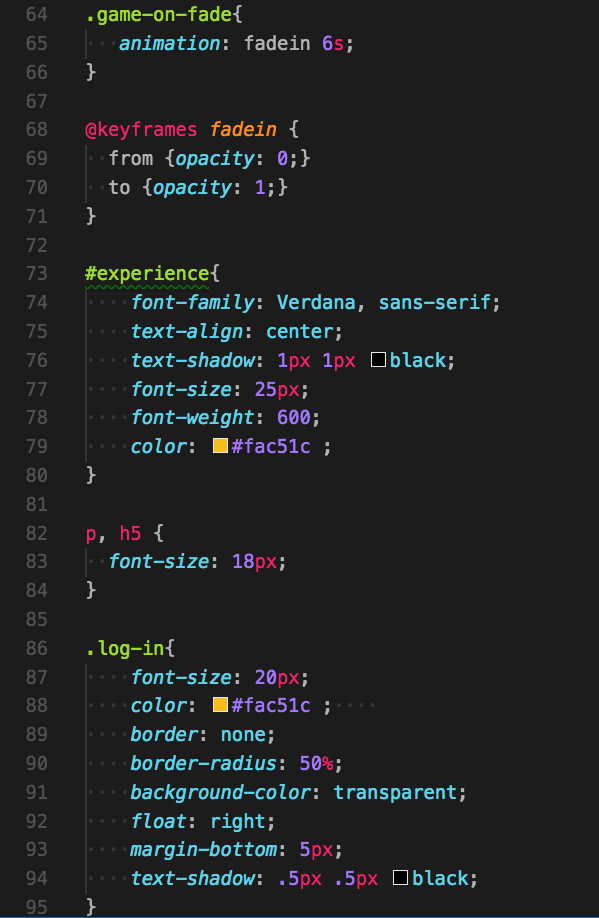</img>
</p>


### Challenge 4 - Chart setup
Getting highcharts to show the data we wanted in the way we wanted it shown proved to be a fairly serious challenge. First, we had to determine what data we wanted from the database, then it needed to be sent to Highcharts for display.
<p align='center'>
    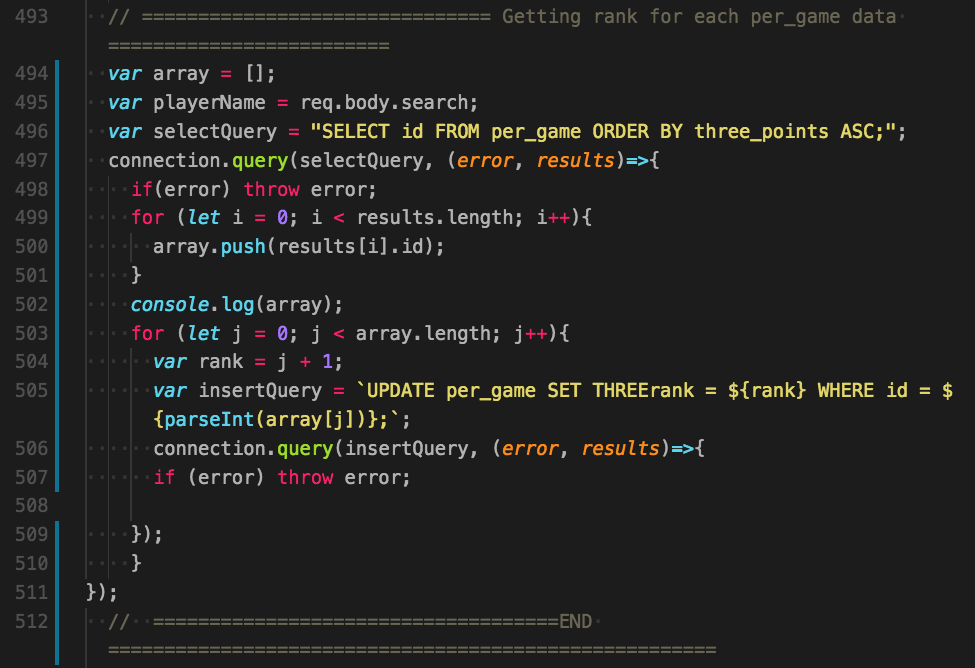</img>
</p>

We quickly ran into a problem of scale for the data. For example, a player might average 0.5 steals per game, yet score 25 points per game. The resulting data display was not ideal, so what we ended up doing was ranking each player based on their stats. The higher the stat, the higher their rank was, so a player in the 99th percentile in points scored is better than a player in the 37th percentile. We also created theoretical "best" and "average" players so that single players could be compared against either the best in the league or the league average. 
<p align='center'>
    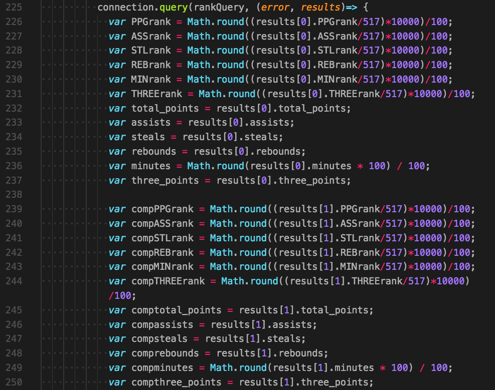</img>
</p>

Finally, we knew we wanted a dark theme for our chart (mainly because it looks cooler than the default light theme). Unfortunately, the Highcharts docs aren't super clear as to how to chnage the theme. We finally figured out how to include a configuration file to set the theme. We added a little styling of our own, and Bob was our uncle.

<p align='center'>
    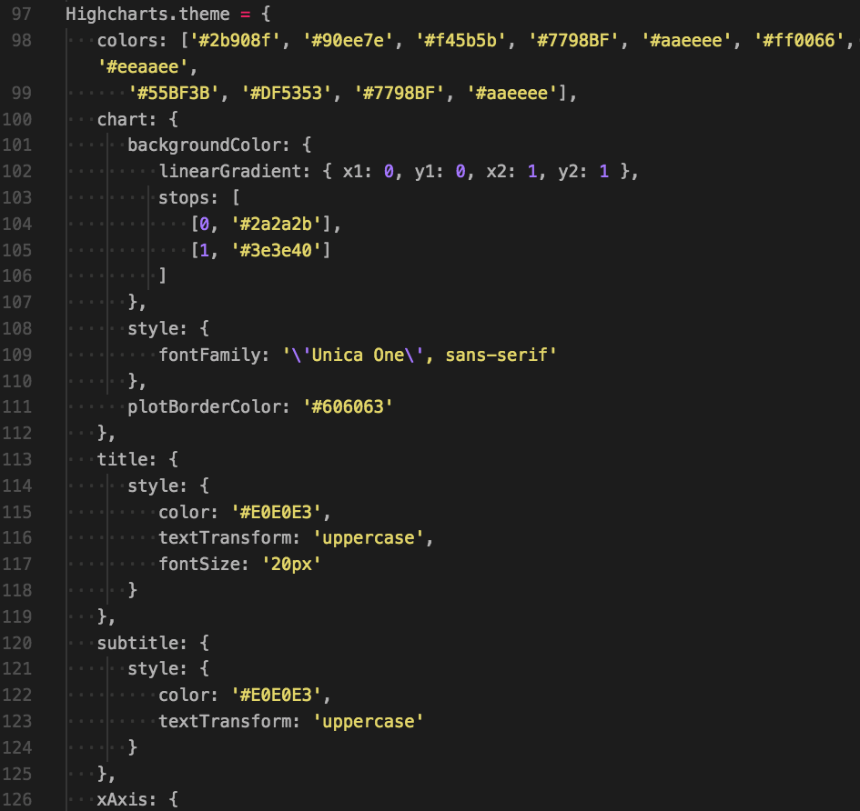</img>
</p>

### Challenge 5 - Add favorite button

In order to provide quick acces to users' favorite players, we wanted them to be able to save these players as part of their account. However, what to do when a user first signs up and doesn't have any favorites saved? The solution we came up with was to create a list of some of the best and most popular players that are randomly selected to populate the chart when no favorites are available.

<p align='center'>
    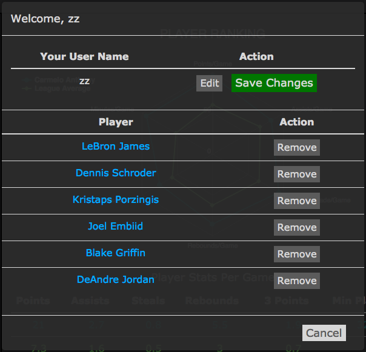</img>
</p>

The problem was that every time the user page reloaded, a new random player was also loaded. What we wanted was for a player that was just selected as a favorite to remain the "current player" on the page. In addition, the modal window we use to display the favorites list would pop up everytime the page loaded, causing the user to have to close the modal to see the page. Further, we needed to add the player to the user's favorites list so that the list was persistent for each individual user. In other words, when you log in to your account, your favorites list is YOUR favorites list, and not a list of all players that have been chosen as favorites.

To tackle the first problem, we added a GET request that redirected the user to the same page, but with the player's id as the URL. This way, the player that was just added as a favorite remains as the current player on the page rather then loading a new random player.
<p align='center'>
    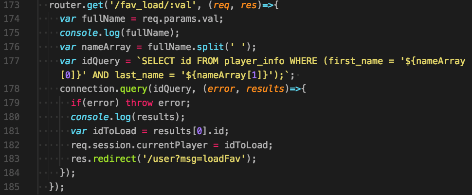</img>
</p>

The second problem was solved simply by setting the modal up so that it only showed when either a user logs in for the first time and/or doesn't have any favorites selected, or the Favorites button in the upper-right corner of the page is clicked.

Solving the third problem required an additional table in the database which holds lists of player ids linked to user logins. Then we had to match the logged-in user info from the session, get all the player ids linked to that user, and then use the INNER JOIN SQL query parameter to reference the player info table, which holds the player names linked to their ids.
<p align='center'>
    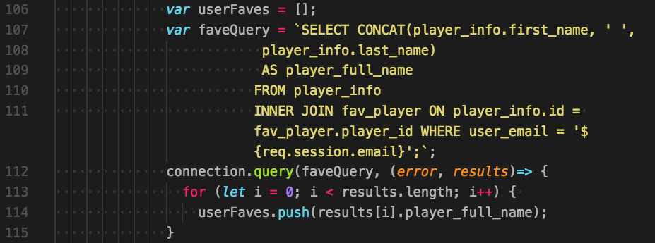</img>
</p>

<br>

### Challenge 6 - Input Validation

One issue that haunted us from the beginning was user input. What if the user searched for the name of a non-current player, or input gibberish? Early on we decided to implement jQuery's Autocomplete function to help out with this. To do so, we populate a list of all players from the database on the fly and compare the list to the user's input. This displays a list of possible matches to what the user has typed in. Some players have apostrophes or hyphens in their names (looking at you, DeAndre' Bembry), so we used a regular expression to filter the input for Autocomplete
<p align='center'>
    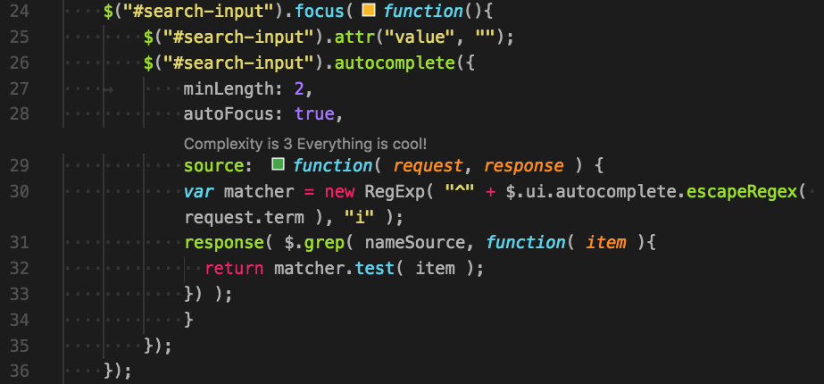</img>
</p>

Later on, we implemented further filters that would check if a name the user typed in is indeed a player, while also taking into account the comparison option the user selected. SO if the user is comparing two players, we check both inputs, and if they are comparing a player to the league average (for example), we don't need to check the other input (which is hidden anyway). If the input is not a valid player name, a message is shown prompting the user to input a valid name.
<p align='center'>
    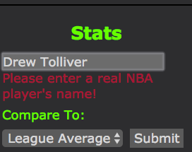</img>
</p>
# Game On
