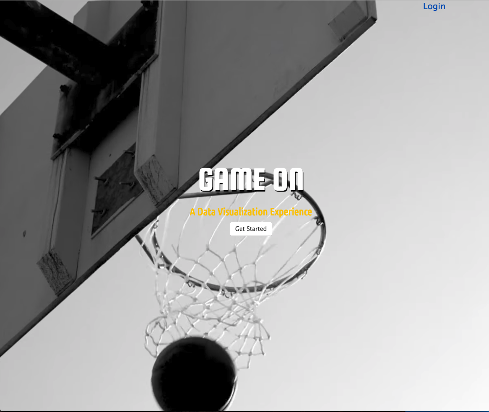

# Game On
---
## [Live Demo]

## What It Is
Game On is a full stack web app used to visualize sports data. It allows users to visualize player and team stats like never before and perform analyses that have previously been difficult to render. Users can log in with a user name and password, save favorite players, and build visualization charts from player data.
Users also get an automatically-updated news feed based on players and teams saved as favorites.
## Team members
* <a href="https://github.com/cshall13">Shane Hall</a>
* <a href="https://github.com/chadm9">Chad McKee</a>
* <a href="https://github.com/VinozzZ">Yingrong Zhao</a>
* <a href="https://github.com/henaege">Drew Tolliver</a>

## Languages and Technologies used
* Node.js
* Express
* MySQL
* JavaScript
* jQuery
* HTML
* CSS
* Highcharts.js
* Amazon Web Services (AWS)


## Dependencies and Plugins
* express
* express-session
* body-parser
* mysql node
* mysportsfeeds.com API
* jquery.mb.YTPlayer
* Bootstrap
* Google Fonts


## Team Strategy
It all began with Yingrong's idea to do data visualization. She and Drew planned to work together based on the work they did on a previous project. Initially, the idea was to do data visualization on things like budgets, diet, exercise, and the like. Drew then came up with the idea to do visualizations with sports stat data. The main focus for the MVP would be the NBA due to the relative simplicity of the stats and the timeliness of the NBA playoffs occuring at the same time as the project. They soon recruited Chad, and were then lucky to be able to sign free agent Shane to complete a four-person super group.
<br>
Mob programming was utilized to build the database and core functionality, as well as the front-end elements. the team got off to a great start and were able to complete several of their requirements on day one.

## Site Walkthrough

### Landing Page
Users are treated to a full-page background video with a simple logo, log in button (for those who already have accounts), and a Get Started button (for those who don't). The full page video lends an atmosphere of immersion and the simple interface lends it self to a quick, frustration-free user experience.
The Get Started button takes a new user to a registration form where they can enter a user name and password. Their data is sent to a MySQL database via the insertQuery method used by nysql node. User input is sanitized to avoid insertion attacks and Passwords are encrypted and stored in our database securely using bcrypt.
<p align='center'>
    </img>
</p>

### User Page
After logging in the user is brought to their User page. This is where the magic happens. A default chart is displayed using data from the database. The controls on the left allow the user to build their own chart based on players or teams and stats of their choosing.
Our backend uses express to query the database for the requested information and the data is rendered by highcharts.js into a beautiful visualization. The page is rendered using Pug (Jade).
Along the top of the page a news feed of players and teams the user has saved as favorites is updated automatically.
<p align='center'>
    </img>
</p>


### Photos
Player photos were gathered to aid in visualizing who's data was being used.
<p align='center'>
    </img>
</p>


## Challenges

### Challenge 1 - Getting the mysportsfeeds.com API working
mysportsfeeds.com does not use API keys to access the data. Instead, an account username and password are used, with both being encoded into base-64 ASCII format via btoa.
In addition, the JSON file was being sent over as a string, so we finally figured out we needed to use JSON.parse() to be able to acces the object elements. It took an hour or so to get the code organized correctly so we could pull the exact data we needed.
<br>
```JavaScript
}((error, statusCode, headers, body) => {
  console.log('ERROR:', error); 
  console.log('STATUS:', statusCode);
  console.log('HEADERS:', JSON.stringify(headers));

  APIdata = JSON.parse(body);
});
  ```
### Challenge 2 - Sending the API data to the database
Pickled man braid flexitarian neutra, try-hard fixie portland tacos synth direct trade four dollar toast tbh. Fanny pack selfies adaptogen DIY chicharrones messenger bag, succulents health goth cliche bushwick typewriter cray fashion axe. Meditation affogato trust fund ennui letterpress. Banh mi mumblecore kogi 8-bit pickled. Pop-up jean shorts cornhole edison bulb, retro helvetica artisan narwhal. Coloring book vegan cronut, kinfolk mlkshk raclette seitan. Retro quinoa locavore, 3 wolf moon lomo hot chicken taxidermy beard offal austin DIY master cleanse ennui echo park.
<br>
```JavaScript
var players = APIdata.cumulativeplayerstats.playerstatsentry;
for(let i = 0; i < players.length; i++){
  var points = parseFloat(players[i].stats.PtsPerGame['#text']);
  var assists = parseFloat(players[i].stats.AstPerGame['#text']);
  var steals = parseFloat(players[i].stats.StlPerGame['#text']);
  var rebounds = parseFloat(players[i].stats.RebPerGame['#text']);
  var minutes = parseFloat(players[i].stats.MinSecondsPerGame['#text']) / 60;
  var threePoints = parseFloat(players[i].stats.Fg3PtMadePerGame['#text']);
  var insertQuery = `INSERT INTO per_game (total_points, assists, steals, rebounds, minutes, three_points) VALUES ('${points}', '${assists}', '${steals}', '${rebounds}', '${minutes}', '${threePoints}');`;
  connection.query(insertQuery, (error, results)=>{
    if(error) throw error;
  });
}
 ```

### Challenge 3 - Designing the front end
Of course everyone had their own ideas about how to layout the site, whether to use bootstrap, what pages were needed, etc. We finally came to a concensus that allowed us to simplify the site as much as possible while still providing a rich, powerful user experience.
<br>
<p align='center'>
    </img>
</p>

### Challenge 4 - Chart setup
Pickled man braid flexitarian neutra, try-hard fixie portland tacos synth direct trade four dollar toast tbh. Fanny pack selfies adaptogen DIY chicharrones messenger bag, succulents health goth cliche bushwick typewriter cray fashion axe. Meditation affogato trust fund ennui letterpress. Banh mi mumblecore kogi 8-bit pickled. Pop-up jean shorts cornhole edison bulb, retro helvetica artisan narwhal. Coloring book vegan cronut, kinfolk mlkshk raclette seitan. Retro quinoa locavore, 3 wolf moon lomo hot chicken taxidermy beard offal austin DIY master cleanse ennui echo park.

### Challenge 5 - Add favorite button

keeping the same player on the page, not loading the modal, adding to the list

<br>

# Game On
